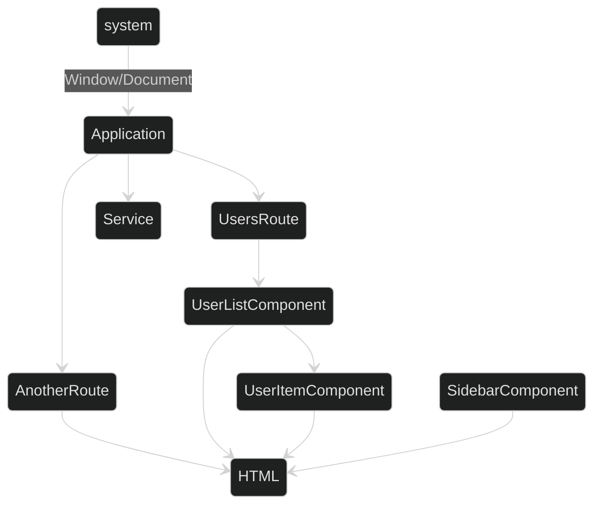

# How memory leaks are made?

Note:
Here's a simple, approximate diagram of an application we'll be debugging later.
Greyed out tile is the current route.

There's the system stuff i.e. whatever browser provides.
The (Ember) Application, some of it's entities, where Route and Components usually result in some HTML.

When we'd now go to `AnotherRoute` we'd expect `UsersRoute` to teardown it's HTML and release related components.
