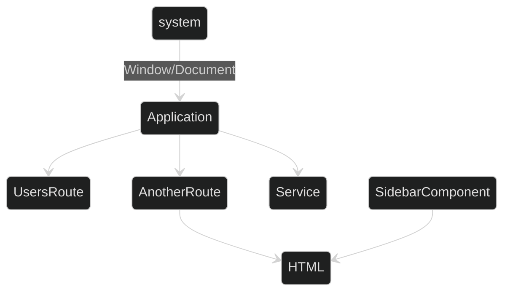

```mermaid after-redirect
%%{init: {'theme': 'dark', 'themeVariables': { 'darkMode': true }}}%%

stateDiagram-v2
    system --> Application: Window/Document
    Application --> UsersRoute
    Application --> AnotherRoute
    Application --> Service

    AnotherRoute --> HTML
    SidebarComponent --> HTML
```

Note:

After we've redirected to `AnotherRoute` the expectation is that it's the only one now that actually consumes memory, however that's not the case in our scenario.
