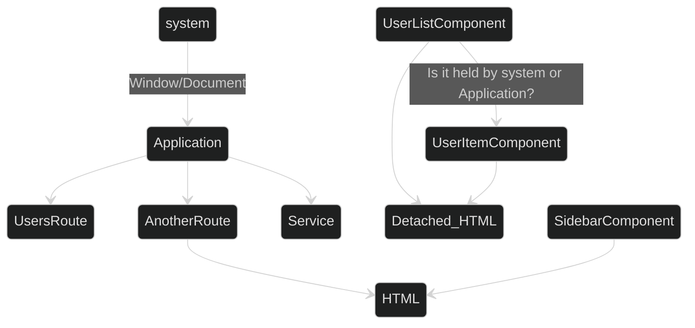

Note:

So we're on `AnotherRoute`, `UsersRoute` did the teardown but there's still components floating in the memory.
That's a memory leak.

We don't know what holds them currently, we'll be taking at snapshots next.
It might seem weird and out of order to show these diagrams now, but I wanted to visualize more-or-less what we'll be looking for.

The go-to idea in my opinion would be pointing at the Application or System. Anything that's global or near global.
